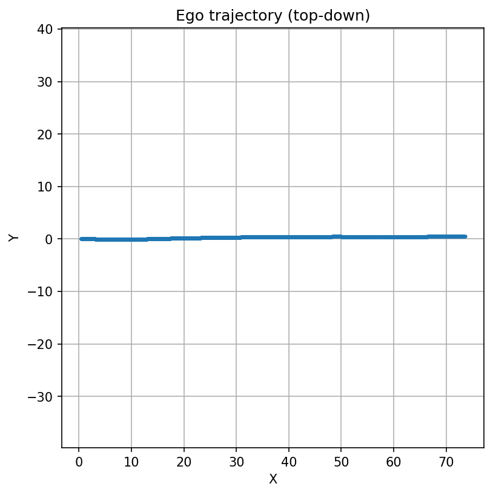
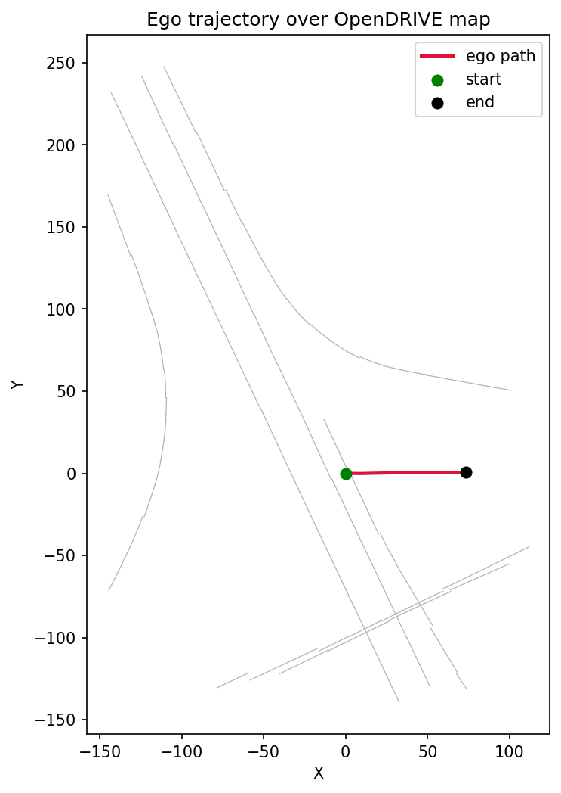

<h1 align="center">NuRec Scene Explorer</h1>

<p align="center">
  <em>Replay a real self-driving capture through its 3D reconstruction (on a 4&nbsp;GB laptop).</em>
</p>

<p align="center">
  
</p>

<p align="center">
  <sub>Camera fly-through of a street reconstructed from a real AV sensor capture (NVIDIA NuRec). Nothing hand-modeled — it's all rebuilt from data.</sub>
</p>

<!--
  GitHub autoplays the GIF above. For the higher-quality MP4 with playback controls,
  drag assets/flythrough.mp4 into the GitHub web editor to get a hosted user-attachment
  URL, then drop it in a <video src="..."></video> tag here. Relative <video> paths
  don't reliably render on github.com, hence the GIF default.
-->

---

Self-driving stacks get tested in simulation long before they touch a public road, and one way to build those simulators is *neural reconstruction*: drive a sensor rig down a street once, then rebuild that street as a 3D scene you can re-render from any viewpoint. NVIDIA's **NuRec** does this with 3D Gaussian Splatting and ships a public dataset of reconstructed driving scenes.

This repo cracks one of those scenes open and visualizes the parts that matter for simulation — the route the car drove, the road network underneath it, and a camera fly-through of the reconstructed street. It runs on a normal laptop with a small GPU, because the work is reading and rendering data NVIDIA already reconstructed, not training anything.

The fly-through above is the reconstructed geometry of a real street — road, curbs, vegetation, buildings — rendered as a gray mesh, camera following the actual driven route. It's gray because the mesh only carries shape; the color lives in a separate Gaussian representation (see [Notes & limitations](#notes--limitations)).

## What's inside a NuRec scene

A scene ships as a `.usdz` — really a zip bundling an OpenUSD description plus sidecar files: an OpenDRIVE map, a `.ply` surface mesh, per-frame ego poses, dynamic-actor tracks, and a checkpoint holding the Gaussians. The `.usdz` won't open as a plain USD stage without NVIDIA's NuRec plugin, so this project skips that path and reads the sidecars directly. That keeps the whole pipeline almost entirely on the CPU — the GPU only does the final mesh rendering.

## Pipeline

| Step | Script | What it does |
| --- | --- | --- |
| 1 | `download_scene.py` | Pulls a single scene from the Hugging Face dataset |
| 2 | `peek_json.py` | Dumps the JSON layout so the parsers target the right fields |
| 3 | `plot_trajectory.py` | Extracts the ego poses (nested 4×4 matrices) into a clean trajectory |
| 4 | `overlay_map.py` | Draws the OpenDRIVE roads with the trajectory on top |
| 5 | `render_flythrough.py` | Renders the mesh fly-through with a road-following camera |

## The messy-data bits

Most of the actual effort went into the fact that real AV data doesn't come clean:

- **Two coordinate frames in one file.** The ego trajectory interleaves local scene coordinates with **ECEF** (Earth-Centered, Earth-Fixed) global coordinates — a handful of poses sitting ~6.3M meters out, one Earth radius away. They get filtered by distance from the median position.
- **Stacked passes.** The trajectory file concatenates several near-identical passes over the same route (one per camera), separated by large jumps. Keeping only the longest continuous run turns it into a single smooth drive.
- **Reconstruction artifacts.** Loose mesh debris is dropped by removing small disconnected clusters. Moving objects (cars, people) survive as blobs — a static surface mesh can't represent something that was in motion during capture.

## Quick start

```bash
# system libs (Open3D needs OpenGL; ffmpeg for video)
sudo apt-get install -y libgl1 libgomp1 ffmpeg git unzip

conda create -n nurec python=3.10 -y && conda activate nurec
pip install -r requirements.txt
```

Grab a [Hugging Face token](https://huggingface.co/settings/tokens), accept the [dataset license](https://huggingface.co/datasets/nvidia/PhysicalAI-Autonomous-Vehicles-NuRec), and `hf auth login`. Then:

```bash
python download_scene.py
unzip -o data/<...>/<scene>.usdz -d unzipped
python plot_trajectory.py unzipped/rig_trajectories.json
python overlay_map.py
python render_flythrough.py unzipped/mesh.ply positions.npy
ffmpeg -i flythrough.mp4 -vf "fps=10,scale=640:-1" assets/flythrough.gif
```

## Outputs

| Ego trajectory | Trajectory on the map | Fly-through |
| :---: | :---: | :---: |
|  |  |  |

## Notes & limitations

The fly-through renders the **mesh**, which is geometry only — hence the gray clay look. The scene's photoreal appearance lives in the 3D Gaussians, a heavier representation this project doesn't render: doing that NuRec-style needs NVIDIA's production pipeline (or at least far more than 4 GB of VRAM), so it's deliberately out of scope and left as future work. Moving objects show up as blobs for the same static-mesh reason. None of that undercuts the point here — the goal was to take a real production AV-sim dataset and stand up a working, reproducible visualization on commodity hardware.

## Layout

```
nurec-scene-explorer/
├── README.md
├── requirements.txt
├── download_scene.py
├── peek_json.py
├── plot_trajectory.py
├── overlay_map.py
├── render_flythrough.py
├── assets/
└── data/            # gitignored — scenes are large
```

## Data & license

Scenes come from NVIDIA's [PhysicalAI-Autonomous-Vehicles-NuRec](https://huggingface.co/datasets/nvidia/PhysicalAI-Autonomous-Vehicles-NuRec) dataset and are subject to its license. This repo ships code only; no dataset assets are committed.

## Built on

NVIDIA NuRec · [Open3D](https://www.open3d.org/) · [pyxodr](https://github.com/driskai/pyxodr) · OpenUSD · OpenDRIVE
